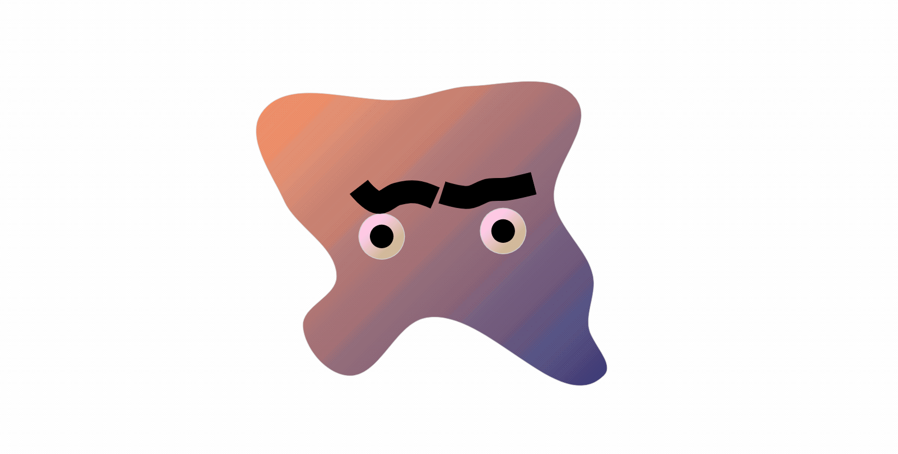

# Undulating, Gelatinous Blob

Blobby effect using helper functions from <a href="https://two.js.org/">the Two.js library</a>. 

<pre>
function change(part, attr, min, max, deltaMin, deltaMax, x) {
    let delta = Math.random() * (deltaMax - deltaMin) + deltaMin;

    if (part[x]) {
        part[attr] += delta;
    } else if (!part[x]) {
        part[attr] -= delta;
    }

    if (part[attr] <= min) {
        part[x] = true;
    } else if (part[attr] >= max) {
        part[x] = false;
    }
}
</pre>

## Blobs

